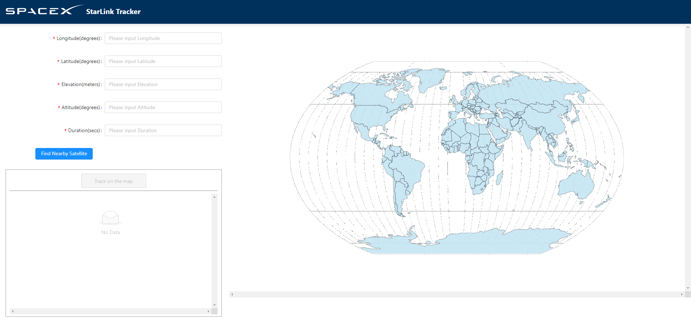
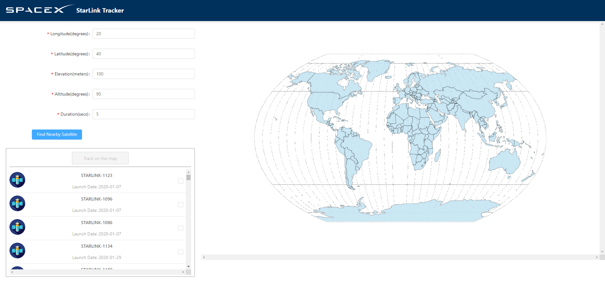
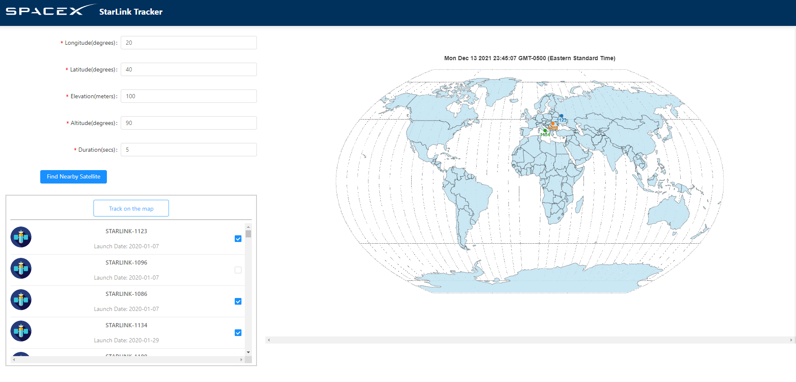

# starlink
This repo contains frontend code of the starlink web application.

### Web Functions
#### 1. Find Satellite
Input the parameters to find satellite.

Satellite info shown in the list.

#### 2. Track Satellite on Map
Select satellites to show the real time locations on the map.
